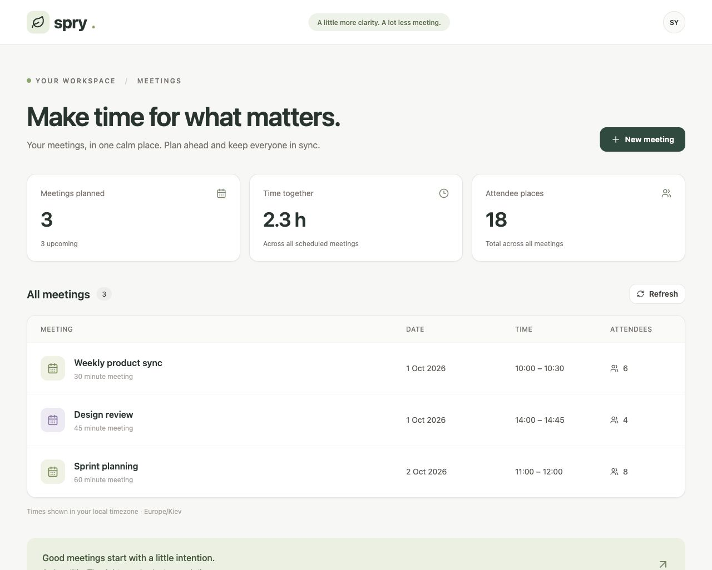

# Spry — meetings workspace

Навчальний monorepo: FastAPI + SQLAlchemy + Alembic, React + Vite + Tailwind та локальні UI-примітиви за підходом shadcn/ui, PostgreSQL, Docker Compose, GitHub Actions і сценарії AWS deploy.

## Онлайн

- Frontend: https://d310vkwtz8a1f0.cloudfront.net
- Backend: https://d310vkwtz8a1f0.cloudfront.net/api/meetings
- Health: https://d310vkwtz8a1f0.cloudfront.net/health
- [Успішний AWS deploy](https://github.com/FourShrimp2032/spry/actions/runs/36727682803/attempts/2)



## Запуск

Встановіть і запустіть Docker Desktop. У корені цього проєкту:

```bash
docker compose up --build
```

Наступні запуски: `docker compose up`.

- Frontend: http://localhost:5173
- Backend / OpenAPI: http://localhost:8000/docs
- Список: http://localhost:8000/api/meetings

Додайте зустріч через **New meeting**, оновіть сторінку. Дані зберігаються у PostgreSQL volume. `docker compose down` зупиняє сервіси зі збереженням даних; `docker compose down -v` видаляє локальні дані.

Час у формі — локальний час браузера; API отримує timezone-aware дату, PostgreSQL зберігає момент часу, відповіді API нормалізовано до UTC.

## Документи

- [PROJECT.md](PROJECT.md) — структура й контракт, записані до генерації застосунку.
- [docs/LAB-ANSWERS.md](docs/LAB-ANSWERS.md) — пояснення рішень для захисту.
- [docs/AWS-CLICK-GUIDE.md](docs/AWS-CLICK-GUIDE.md) — покроковий запуск у Safari через CloudShell; починаємо з read-only preflight.
- [docs/AWS.md](docs/AWS.md) — ресурси, HTTPS, OIDC, налаштування й teardown.
- [docs/SUBMISSION.md](docs/SUBMISSION.md) — стан і список матеріалів для здачі.

## Перевірки

CI на кожен push та pull request запускає Ruff, ESLint, Prettier, production build та API-тести на PostgreSQL. У backend перевіряються створення, повторне читання, сортування і валідація. Тести навмисно відмовляються очищати базу без суфікса `_test`.

Для запуску поза Docker потрібні Python 3.12.10, Node 22.16.0, npm і окрема PostgreSQL база `spry_test`. Встановіть `backend/requirements-dev.txt`, задайте `DATABASE_URL`, виконайте `alembic upgrade head` у backend, потім `make check` із кореня.

## Deployment

Після налаштування AWS і repository variables із `docs/AWS.md`:

```bash
make deploy-backend
make deploy-frontend
```

CI викликає ті самі команди після успішних перевірок на main. Без `AWS_ROLE_ARN` deploy job пропускається — це ще не успішне розгортання. Образи тегуються повним SHA коміту. Міграція — окреме ECS task перед оновленням сервісу.

## Межі цієї роботи

Проєкт базується на клоні https://github.com/dobosevych/OneTwoThree зі збереженою Git-історією. Лабораторна гілка замінює розширений Cognito/Lambda варіант мінімальним Spry відповідно до завдання. GitHub: https://github.com/FourShrimp2032/spry (public). AWS region: eu-north-1. AWS stack `spry-lab` створено, застосунок розгорнуто та перевірено через HTTPS. Готовий `infra/aws-stack.json` створює інфраструктуру через CloudFormation; ресурси платні, створення виконано з дозволу власника акаунта. Окремі JSON-шаблони ролей/task з placeholders — довідкові альтернативи для ручного налаштування. Власного домену поки немає: перший запуск використовує тимчасову CloudFront HTTPS-адресу. Референс Lab 1 відсутній; UI — власне оформлення. Статистика рахується з реальних зустрічей; вигаданих week-over-week відсотків немає.
